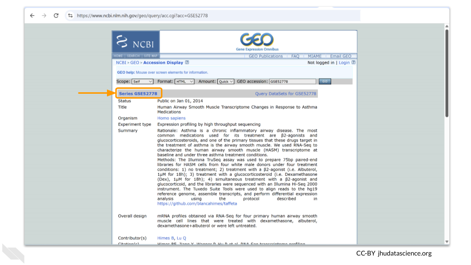
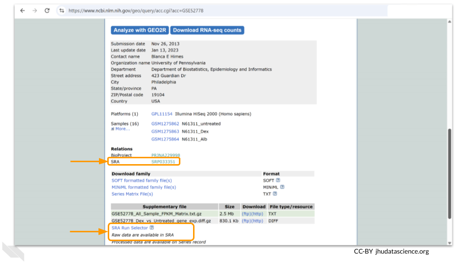
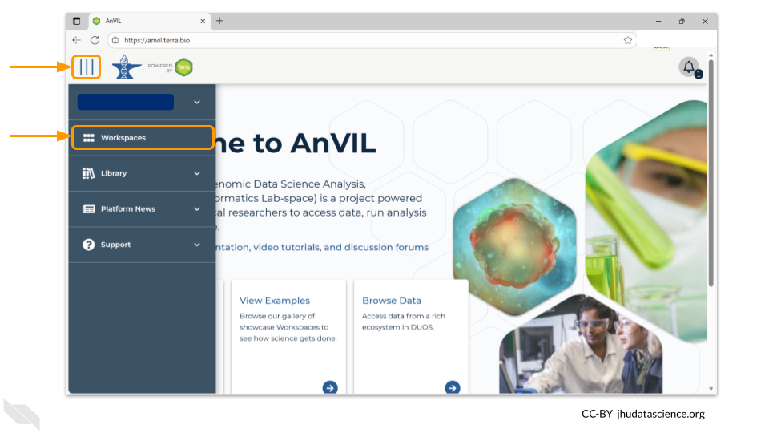
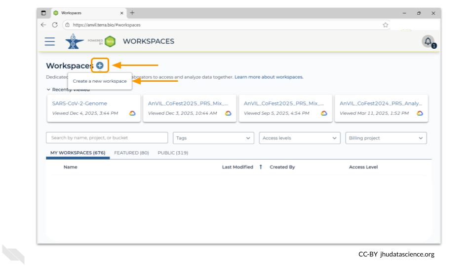
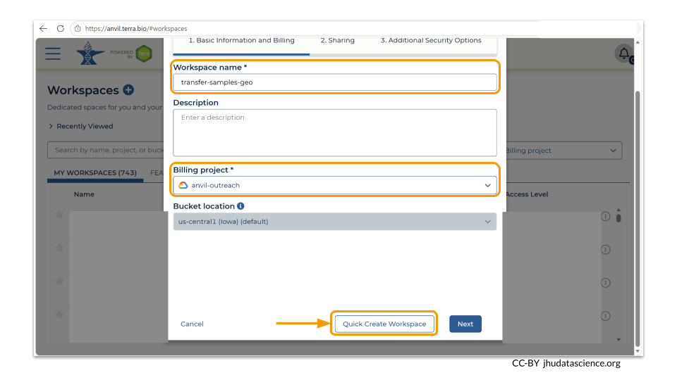
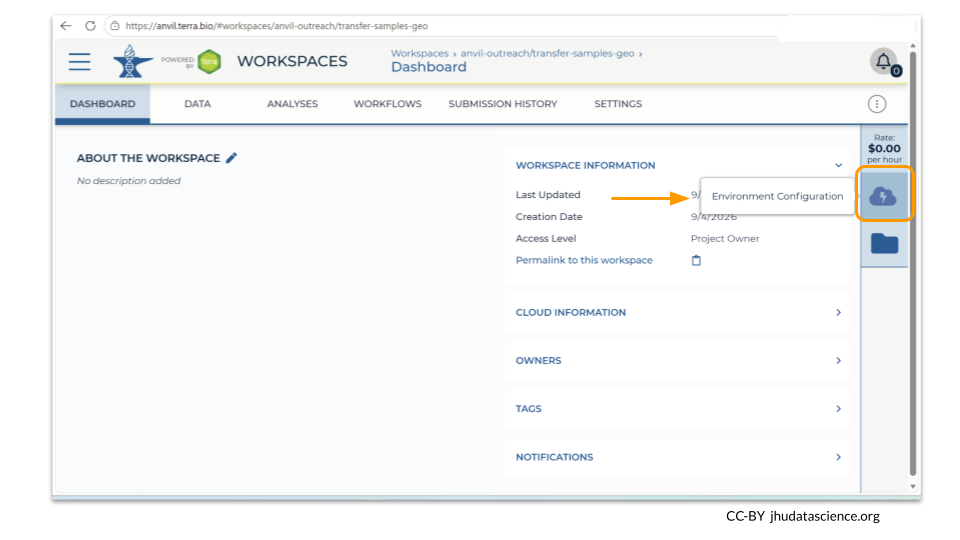
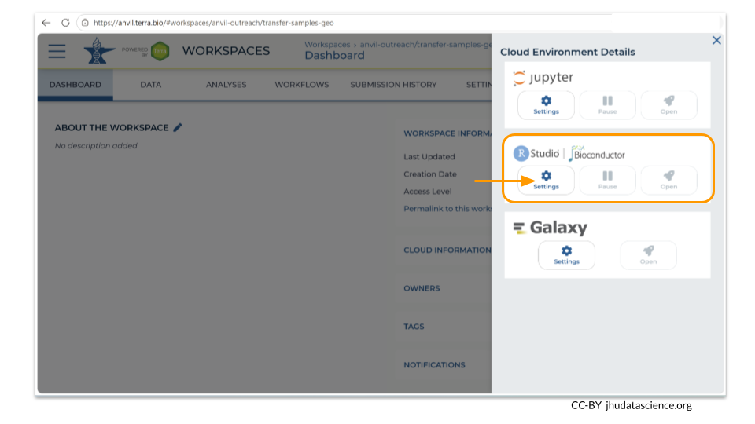
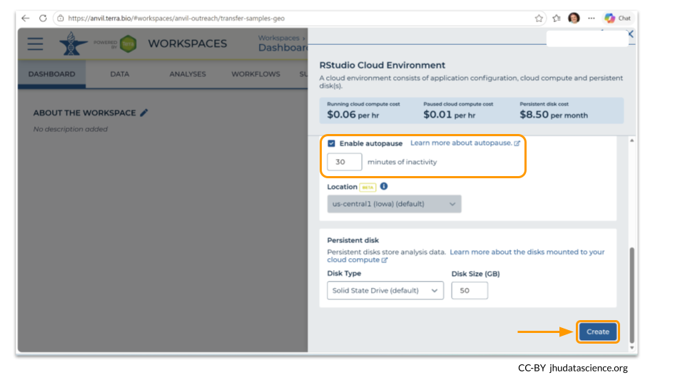
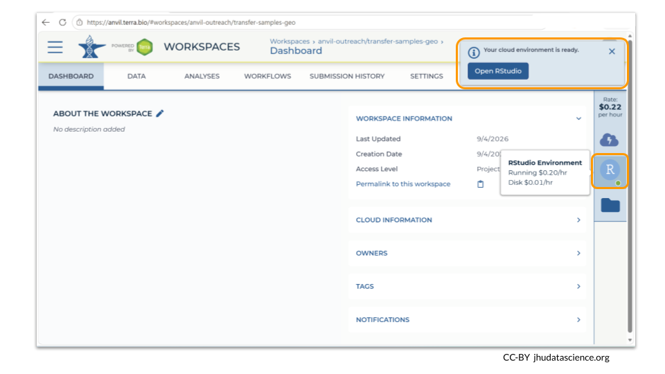

# From Gene Expression Omnibus (GEO) {#importing-geo}

In this example, we will be importing some RNA-seq data generated using four primary human airway smooth muscle cell lines. Researchers explored how three common asthma treatments (dexamethasone, albuterol, or dexamethasone+albuterol) affect gene expression in smooth muscle cells. The data comes from [this BioProject](https://www.ncbi.nlm.nih.gov/bioproject/PRJNA229998).

We will bring this data into AnVIL from the **Gene Expression Omnibus**, or GEO. You can check out the [GEO Datasets  website](https://www.ncbi.nlm.nih.gov/gds) to learn more:

> GEO is an international public repository that archives and freely distributes microarray, next-generation sequencing, and other forms of high-throughput functional genomics data submitted by the research community.

The GEO DataSet corresponding to this project is located [here](https://www.ncbi.nlm.nih.gov/geo/query/acc.cgi?acc=GSE52778).



**Many GEO datasets will also have an associated SRA BioProject number.** NCBI will automatically add the files to SRA if the GEO dataset contains raw next-generation sequencing data (like FASTQ or BAM files). In this case, we recommend importing the data from SRA following [this example](https://hutchdatascience.org/Data_on_AnVIL/importing-sra.html#importing-sra)

You can see the associated SRA references at the bottom of the GEO page.



::: {.notice}
_Genetics_

**Novice**: no genetics skills needed

_Programming skills_

**Novice**: no programming skills needed
:::

::: {.notice}
**What will this cost?**

You might hear new terms for moving data around in the cloud. **Ingress** is when data comes to you, similar to downloading a file or receiving an email with an attachment. **Egress** is sending the data to another resource, similar to uploading or sending an attached file via email. **There is no fee for ingressing data to AnVIL from GEO**, but there is a small cost for storing the data in an AnVIL bucket.

There is a cost associated with provisioning and running an RStudio or Jupyter Notebook environment. ADD COST
:::

## Step One: Create your workspace

The starting point for bringing your own data to AnVIL is the workspace. Before you can do anything, you will need to create a workspace. Once you have logged into your AnVIL account, click on "Workspaces" in the left-side menu. You can open this menu by clicking the three line icon in the upper left hand corner.



Once you have opened the workspace page, create a new workspace by clicking on the plus sign at the top.



You should now see a pop-up window that lets you customize your new workspace. You will need to give your new workspace a unique name and assign it to a billing project. The "anvil-outreach" billing project is used here as an example, but you will not be able to assign it. You'll have to use one of your own billing projects. After filling out these two fields, click the "Quick Create Workspace" button to create a workspace without enabling sharing or additional security options.



You can read about Authorization Domains for workspace security in [this article](https://support.terra.bio/hc/en-us/articles/8527464803739-How-to-set-up-and-use-an-Authorization-Domain) in the Terra documentation.

Once you have created a workspace, AnVIL will take you to the workspace dashboard.

## Step Two: Open an RStudio or Jupyter Notebook environment.

We're going to use the Bioconductor package `GEOquery` to pull the GEO records into the computer environment. You can use either RStudio or Jupyter Notebook. For the purposes of this vignette, we are demonstrating with RStudio.

First, click on the cloud icon on the left hand meny to access the Cloud Environment options.



Next, provision an RStudio environment. Click on the "Settings" button under the RStudio/Bioconductor card. 



You will now be prompted to make decisions about what computational settings you need for your RStudio environment. We have used the default parameters. (Notice that the estimated cost for creating and running your environment is written at the top of the screen - these estimates may change if you change your parameter settings!) If you know that you might be called away from your computing environment and don't want to incur costs while this is happening, you can choose to enable autopause as well. Once you are happy with your setting choices, click "Create".



It may take some time for your environment to be created. As of September 2026, it took 2 minutes for this workspace to be provisioned as we clicked "Create".

Once your environment has been created, click on the R symbol in the left hand menu to open it. You will know that the environment is ready when there is a green dot next to the R symbol. (A popup window will also show up, informing you the environment is ready.)



## Step Three: Retrieve GEO project using GEOquery package

Retrieving data from GEO is greatly simplified by the `GEOquery` Bioconductor package. This package contains a lot of useful functions and you can read more about all the options on the [package website](https://seandavi.github.io/GEOquery/index.html).

But before we do anything, we need to install the package and load the library. Because `GEOquery` is a Bioconductor package, we use the `BiocManager` command to install it. Type these commands into the console window to install the package and then open it:


``` r
BiocManager::install("GEOquery")
library(GEOquery)
```

We have a couple of options for retrieving files from GEO. The `getGEO` function allows us to retrieve several different kinds of data about the GEO project. In this example, we will the details of the experiment as a SummarizedExperiment object, with each row corresponding to a feature and each column corresponding to a sample. The metadata will be stored as a header. Type the following code in to the console:


``` r
gse <- getGEO("GSE52778", GSEMatrix = TRUE)
```

You can find details on other types of data formats and how to pull them into your R environment in the [`GEOquery` user manual.](https://seandavi.github.io/GEOquery/articles/geo-data-formats.html)

After running the `getGEO` command, you should now see the data stored as an object named `gse` in your environment panel.


## Step Four: Push data into a Google bucket using AnVILGCP package

At this point you can start working with the GEO data. However, the data has only been pulled into your R environment. In order to save it in the AnVIL workspace, we need to use a package called `AnVILGCP`. Install this package and open the `AnVILGCP` library using the following commands:


``` r
BiocManager::install("AnVILGCP")
library(AnVILGCP)
```

The `AnVILGCP` package allows us to save the dataset locally (that is, on the persistent disk) as well as to the Google bucket that is associated with the workspace. To save the dataset locally, you just need to know the name of the object and the name you want to save the dataset as. Here, we're saving the SummarizedExperiment we pulled into the environment earlier as "my_dataset.rds".


``` r
# Save dataset locally
saveRDS(gse, file = "my_dataset.rds")
```

You can see that the dataset has now been saved to the persistent disk by looking at the Files tab.


The `saveRDS` command only saves the data to the persistent disk associated with the R environment. You will be able to access the data again when you create a new R environment (as long as you kept your persistent disk), but others who clone the workspace will not have access to it. In order to save the data to the workspace itself, we need to copy the RDS file to the Google bucket associated with the workspace. You can do this using the following commands:


``` r
# Copy to the workspace bucket 
# avstorage() automatically maps to your workspace's bucket path
AnVILGCP::avcopy("my_dataset.rds", avstorage())
```

Once the dataset has been successfully saved to the Google bucket, you can click on the workspace Files icon to see its location. You will see your object in a directory labeled with the name of your workspace. You can also click on the button in the upper right hand corner to open the Google bucket itself.


## Summary

- Create a workspace
- Provision RStudio or Jupyter Notebook environment
- Retrieve GEO data using `GEOquery`
- Push data into a Google bucket with `AnVILGCP`

## Additional Resources

- Want to learn more about the AnVIL Bioconductor package? You can see a talk about it [here](https://anvilproject.org/learn/run-interactive-analyses/the-r-bioconductor-anvil-package)

- Additional information about the AnVIL Bioconductor package can be found on the [Bioconductor website](https://anvil.bioconductor.org/)

- Learn more about moving data to and from Google buckets [here](https://support.terra.bio/hc/en-us/articles/4409101169051-How-to-move-data-to-from-a-Google-bucket).
