# From Sequence Read Archive (SRA) {#importing-sra}

In this example, we'll bring some metagenomic data into AnVIL. This data comes from [this BioProject](https://www.ncbi.nlm.nih.gov/bioproject/PRJNA904247), which collected soil samples to study bacterial communities in tallgrass prairie. Bacteria play an important role in this ecosystem, but can be changed by disturbance, management, and the presence of herbivores.

We will bring this data into AnVIL from the **Sequence Read Archive**, or SRA. You can check out the [SRA website](https://www.ncbi.nlm.nih.gov/sra) to learn more:

> Sequence Read Archive (SRA) data, available through multiple cloud providers and NCBI servers, is the largest publicly available repository of high throughput sequencing data. The archive accepts data from all branches of life as well as metagenomic and environmental surveys. SRA stores raw sequencing data and alignment information to enhance reproducibility and facilitate new discoveries through data analysis. 

The SRA Data corresponding to this project is located [here](https://www.ncbi.nlm.nih.gov/Traces/study/?acc=SRP409181&o=acc_s%3Aa).

::: {.notice}
_Genetics_

**Novice**: no genetics skills needed

_Programming skills_

**Novice**: no programming skills needed
:::

::: {.notice}
**What will this cost?**

You might hear new terms for moving data around in the cloud. **Ingress** is when data comes to you, similar to downloading a file or receiving an email with an attachment. **Egress** is sending the data to another resource, similar to uploading or sending an attached file via email. **There is no fee for ingressing data to AnVIL from SRA**, but there is a small cost for storing the data in an AnVIL bucket.

There is also no cost for importing a workflow into your workspace, but there may be a cost for running a workflow. The workflow used in this vignette cost $0.07 total. We used it to import 10 samples into our workspace.
:::

## Step One: Create your workspace

The starting point for bringing your own data to AnVIL is the workspace. Before you can do anything, you will need to create a workspace. Once you have logged into your AnVIL account, click on "Workspaces" in the left-side menu. You can open this menu by clicking the three line icon in the upper left hand corner.

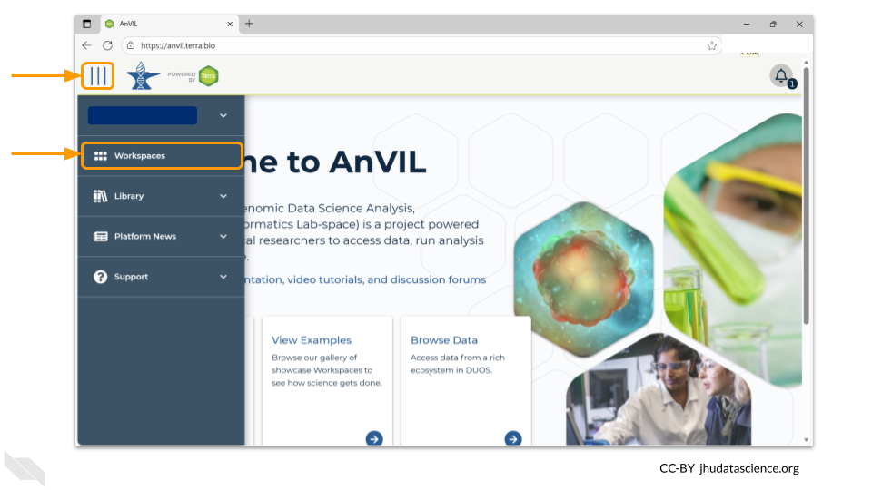

Once you have opened the workspace page, create a new workspace by clicking on the plus sign at the top.

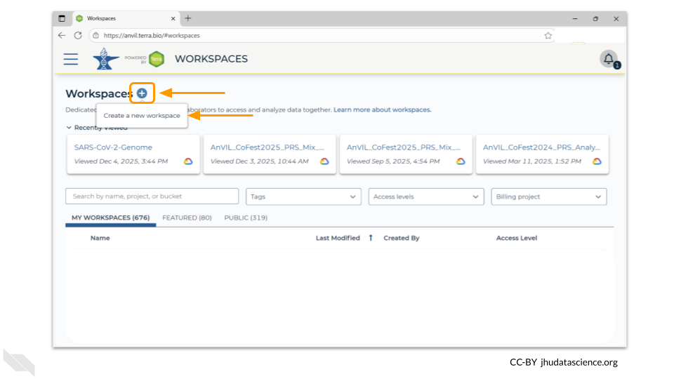

You should now see a pop-up window that lets you customize your new workspace. You will need to give your new workspace a unique name and assign it to a billing project. The "anvil-outreach" billing project is used here as an example, but you will not be able to assign it. You'll have to use one of your own billing projects. After filling out these two fields, click the "Quick Create Workspace" button to create a workspace without enabling sharing or additional security options.

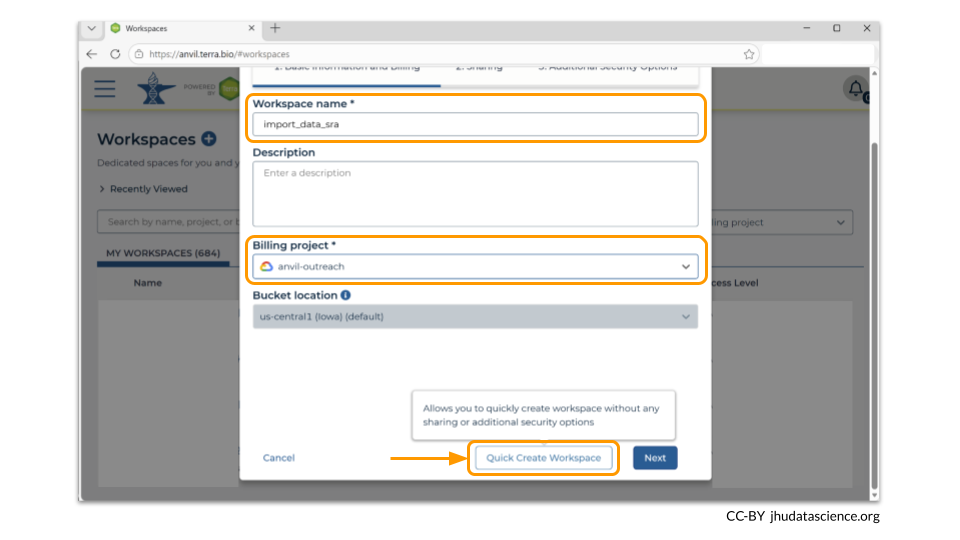

You can read about Authorization Domains for workspace security in [this article](https://support.terra.bio/hc/en-us/articles/8527464803739-How-to-set-up-and-use-an-Authorization-Domain) in the Terra documentation.

Once you have created a workspace, AnVIL will take you to the workspace dashboard.

## Step Two: Import WDL workflow

In your new workspace, navigate to the Workflows tab. Any workflows that have been imported to the workspace will be displayed here. Since this is a new workspace, there are no workflows displayed. 

Click on "Find a Workflow" to get started.

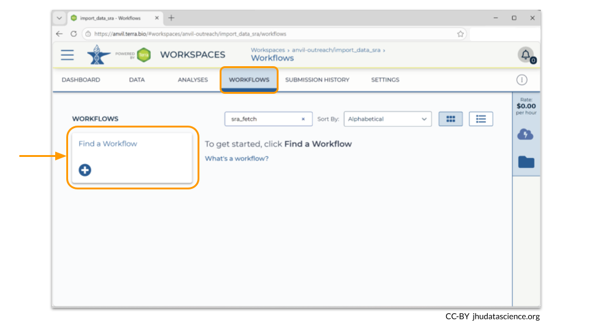

A pop-up window will appear, asking if you'd like to import a workflow from either Dockstore.org or the Terra Workflow Repository. Click on the Dockstore.org box.

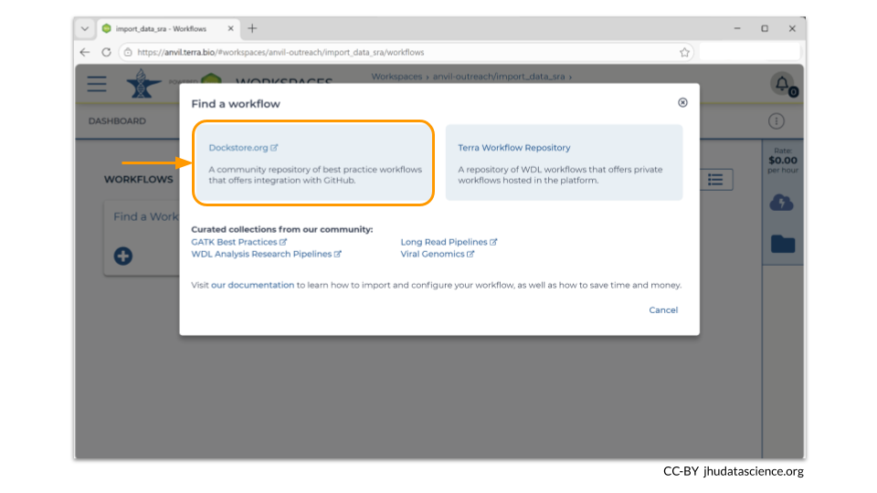

A new browser window will open, showing a search page on Dockstore. Typically, you would search for a workflow for a particular task. In this case, maybe you would type "sra fetch" or "sra import" into the search bar and hit enter. By default the "WDL" option will be chosen as the workflow language. 

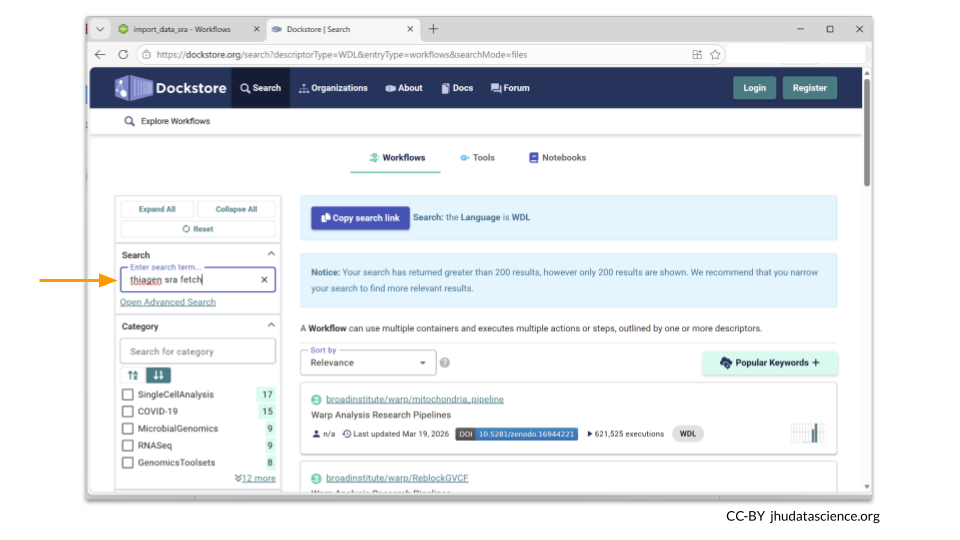

In late March 2026, there were more than 400 WDLs deposited in Dockstore that helped with automating SRA workflows. 

We personally like the SRA_Fetch_PHB workflow written by Theiagen. For ease, paste this link into your browser to be automatically directed to it: [https://dockstore.org/workflows/github.com/theiagen/public_health_bioinformatics/SRA_Fetch_PHB](https://dockstore.org/workflows/github.com/theiagen/public_health_bioinformatics/SRA_Fetch_PHB).

You should now see the page for the WDL you have chosen. WDLs from Dockstore can be imported into AnVIL with the click of a button. Choose the "AnVIL" box on the right side of the page.

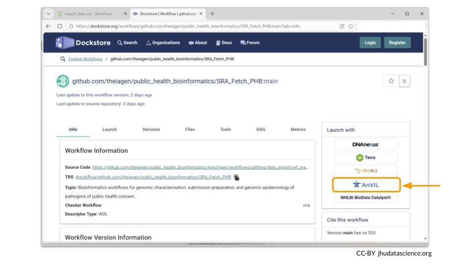

A new browser window for AnVIL will open and prompt you to choose the workspace you'd like to import the WDL to. Choose the name of the workspace that you created earlier. Notice that the workspace name starts with the billing project. In our example, the workspace is "anvil-outreach/import_data_sra". Your workspace will be differ and be named based on your billing project and the workspace name you chose. Once you have chosen the appropriate workspace, click Import.

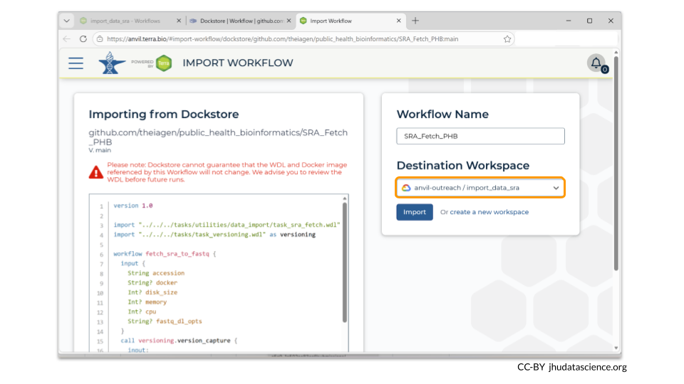

After you have imported the workflow, you will be automatically redirected to the input page for it. However, you will always be able to access it in the future as an option on the Workflow tab!

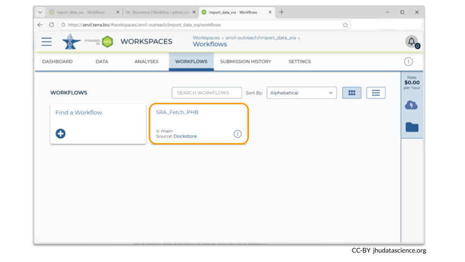

## Step Three: Import sample TSV file

The WDL you have chosen requires a list of the SRA samples you want to import into your workspace. You can do this sample by sample, but a more efficient way is to save the sample IDs to a TSV file and let AnVIL run parallel workflows for each sample. 

::: {.notice}
You can customize which samples you want for your workflow later.
:::

Let's take a moment to get acquainted with the new file we'll be uploading.

First, download the samples file here: [sra_samples.tsv](https://github.com/fhdsl/Data_on_AnVIL/tree/main/data/sra_samples.tsv). You might have to right-click and "Save as".

Next, open the file on your local machine. This is what it might look like in a text editor:

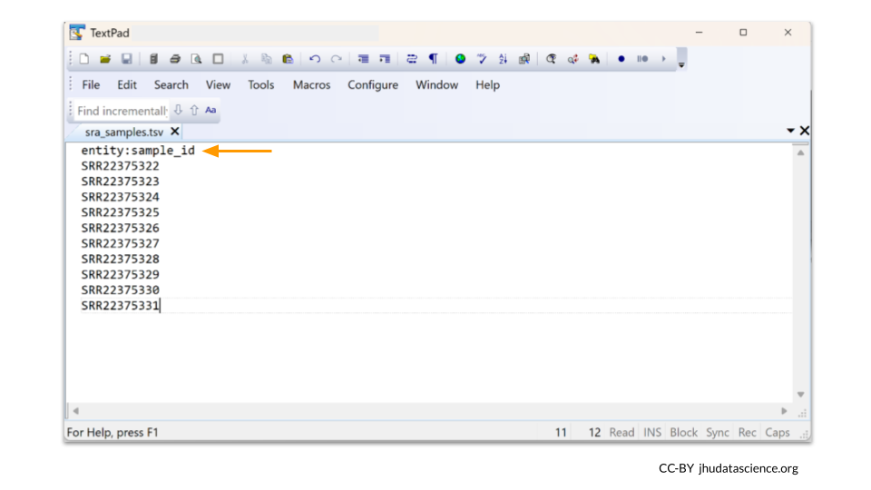

::: {.notice}
The column header `entity:sample_id` is important. `entity:` is required. `sample` becomes the name of the data table. So for example, if our header was `entity:reference_id`, a data table called "reference" would be created in AnVIL. If you didn't want to overwrite anything in the original "samples" table, you could change the column header. As long as none of the IDs are the same, no data will be overwritten. 
:::

Next, navigate to the Data tab in your workspace. Click on IMPORT DATA and select "Upload TSV".

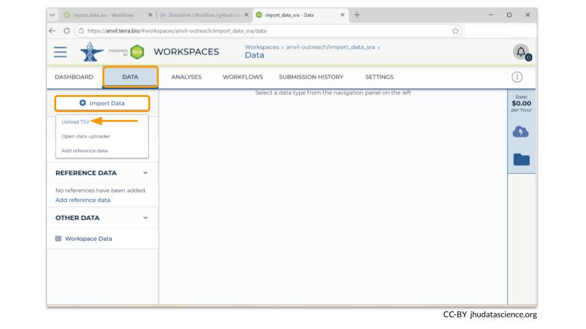

This opens a popup that looks like this:

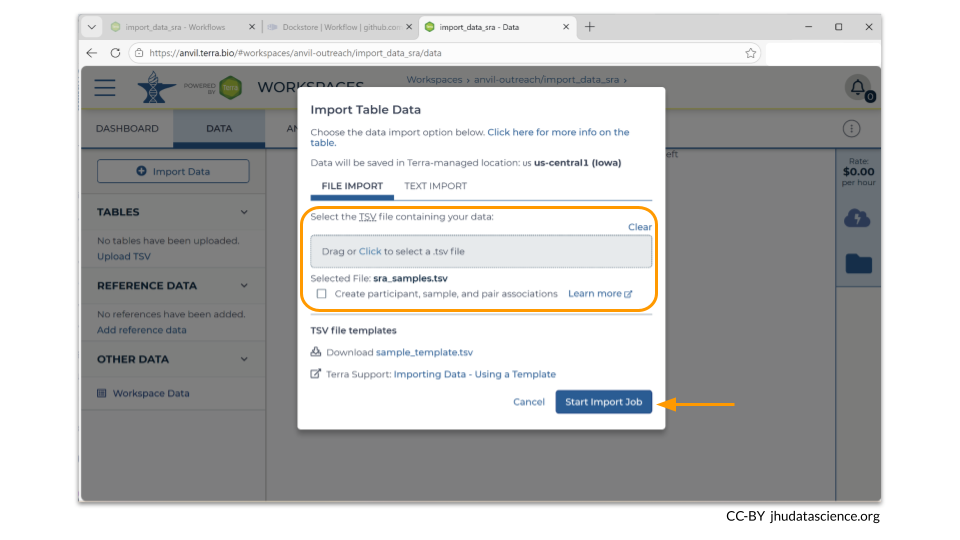

Click to select your samples.tsv file, then click START IMPORT JOB.

Now when we look at the "samples" table in the Data tab, we can see that our samples have been added!

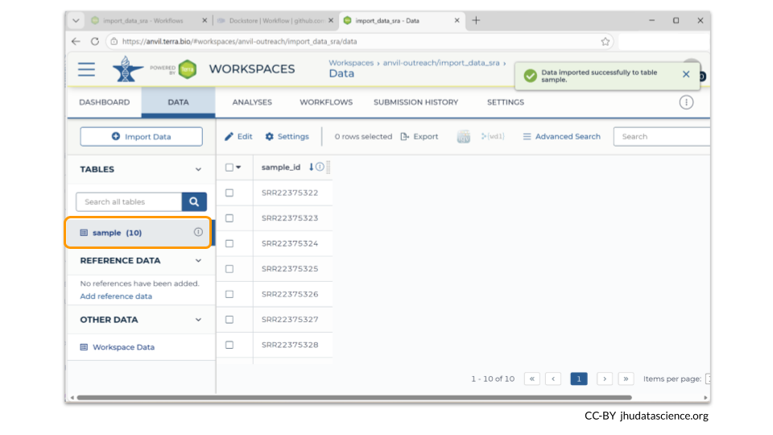

## Step Four: Launch workflow

We are finally ready to launch the workflow! Navigate to the Workflows tab and choose the WDL we imported previously.

Most of the default options are fine for now, but we do want to tell the workflow to pull the sample names from the table we created earlier. Choose the radio button to select "Run workflow(s) with inputs defined by data table", then click the "Select Data" button under Step 2.

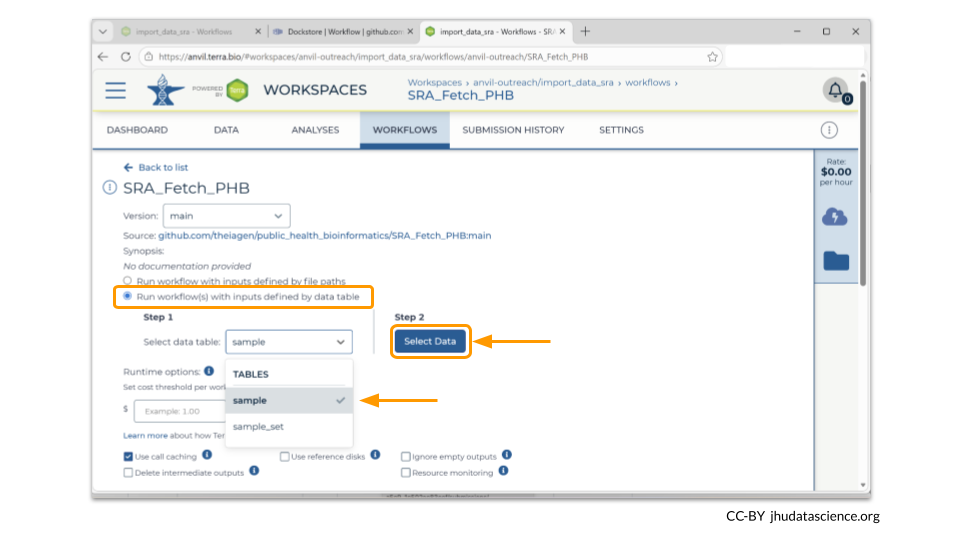

A new screen will open showing the sample IDs from the data table. Make sure the box next to each sample is checked. At the bottom of the screen, you will again have the option to import these samples as a sample set (this box will be checked by default). Uncheck this box, then choose the OK button in the lower right corner.

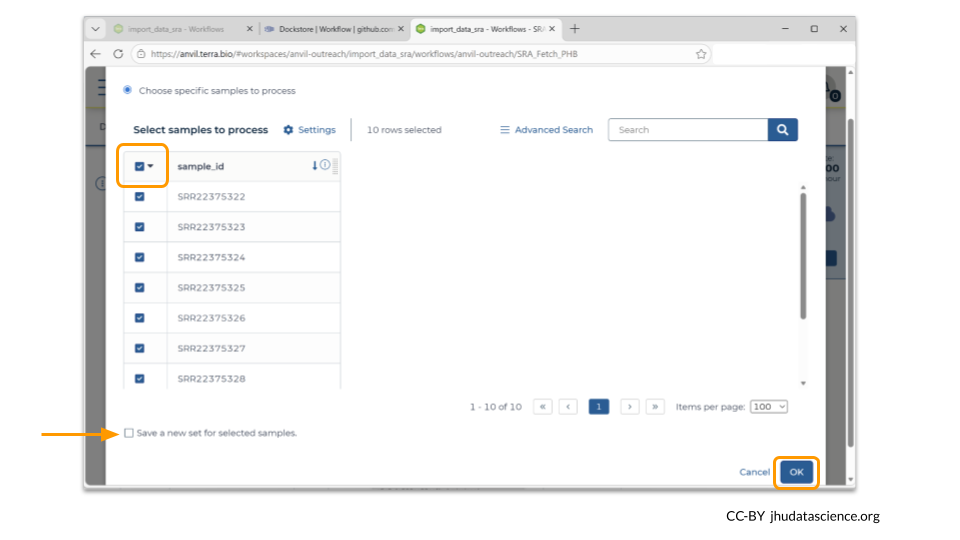

After you have chosen the samples, make sure the sample input field for the workflow reads "this.sample_id". You may need to click on the field and choose "this.sample_id" from a menu. This just means that this workflow will run for each ID in the data table. The other input fields can be left as "optional". Click Save.

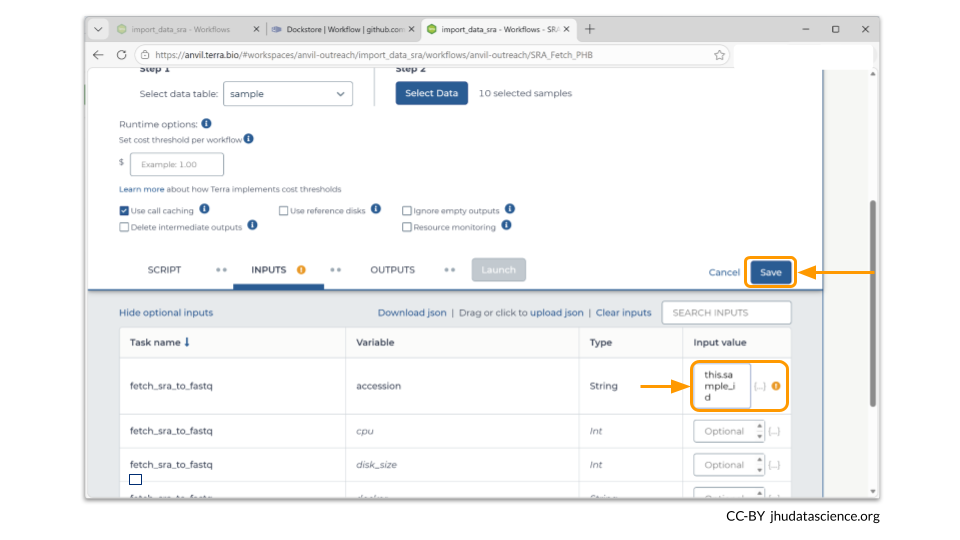

Once the inputs have been saved, you can start the workflow by clicking the Launch button.

::: {.notice}
It's important to remember that workflows will incur charges. It's always a good idea to test how much a workflow will cost to run with a small test run before trying your full sample set.

You can also set a cost limit for a particular workflow. The option for setting a cost threshold is located just underneath the "Select Data" button on the workflow setup page.
:::

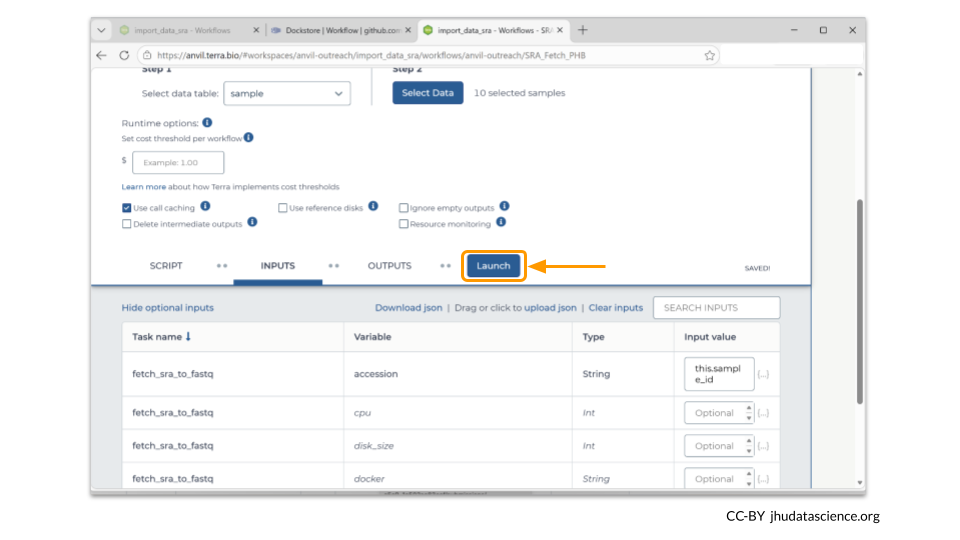

## Step Five: Check workflow progress

Details about all jobs, including workflow progress, can be accessed via the Submission History tab. You can click on a given job ID to access the specifics for that particular job.

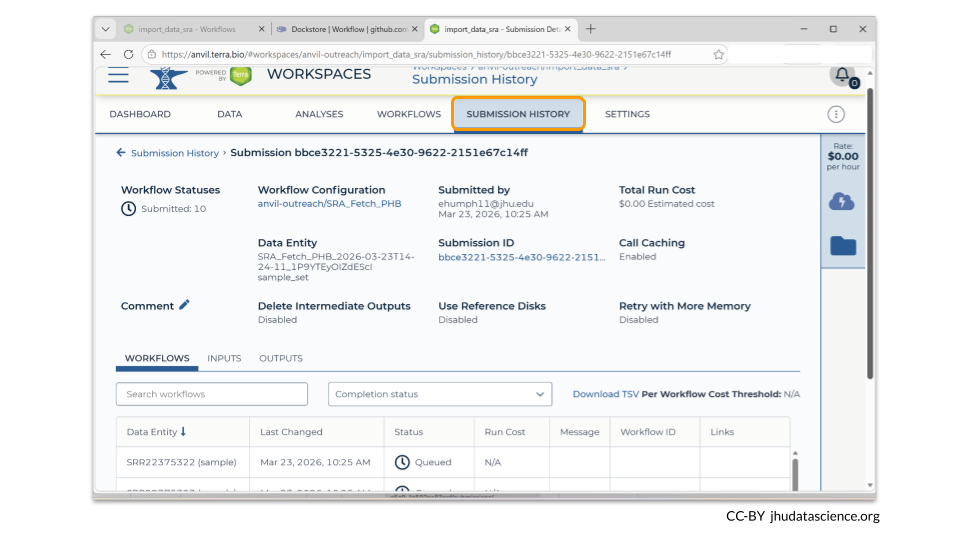

At the bottom of the page, you can see the progress of each individual workflow submission. Because we had 10 sample IDs, we actually launched 10 individual workflows to retrieve the SRA data. These jobs will run in parallel. In late March 2026, we ran this particular workflow twice. The first time, most SRA samples were retrieved within 6 minutes, although the final two took 20 minutes. In our second trial, all samples were retrieved within 6 minutes.

For each individual run, you can see the status of the workflow. When they have all completed, the status will say "Succeeded".

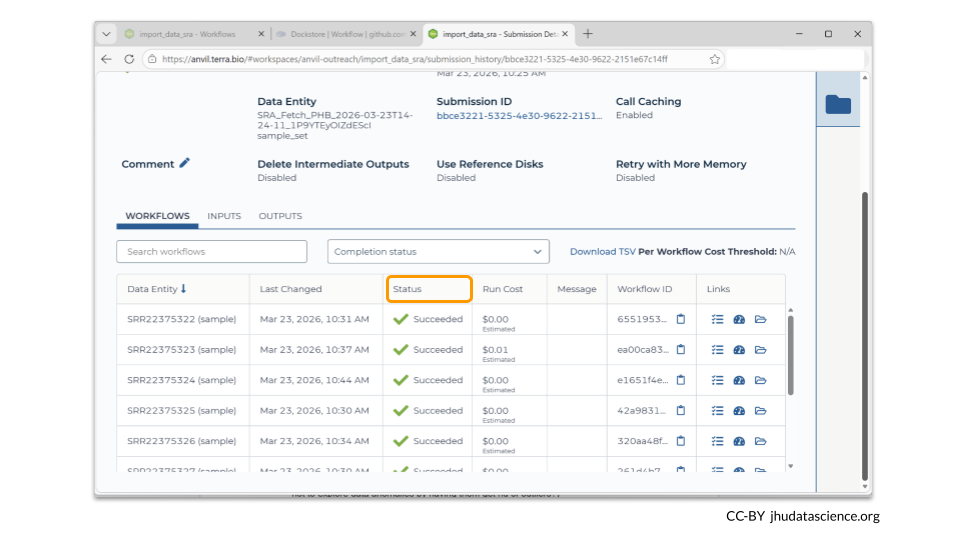

## Step Six: Locate transferred data

Once all the jobs have completed successfully, you should check that you can find the transferred data. This particular workflow is nice because it automatically populates the sample table we created in Step Three with details about the samples that have been retrieved from SRA.

To get back to that table, click on the Data tab and choose "sample".

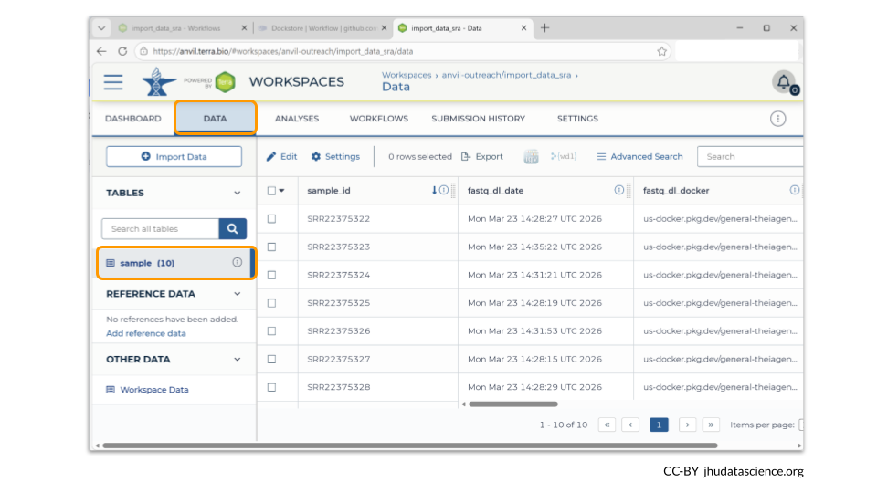

You can scroll through the table to see all the sample metadata. Links to the data can be found under the "read1" column. Each name is a hyperlink to the file, which includes the workspace Google bucket address. 

::: {.notice}
Remember, data stored in AnVIL workspaces will be saved in the workspace's Google bucket! You can right-click the file name to copy the Google bucket address. This address can be used to bring files into AnVIL's computing environments, such as Jupyter / Terminal or RStudio.
:::

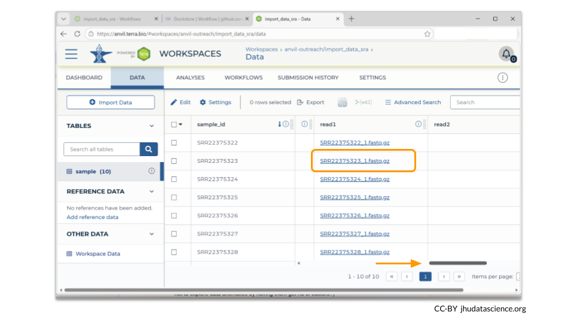

You can also left-click the file name to get a pop-up with details about the sample, including the file size. It's a good idea to check that the file size is what you are expecting!

This pop-up gives you  the option to download the FASTQ files retrieved from SRA. Downloading the files from AnVIL (also called "data egress") will cost a small amount. However, you do not have to download them in order to work with the data within an AnVIL computing environment.

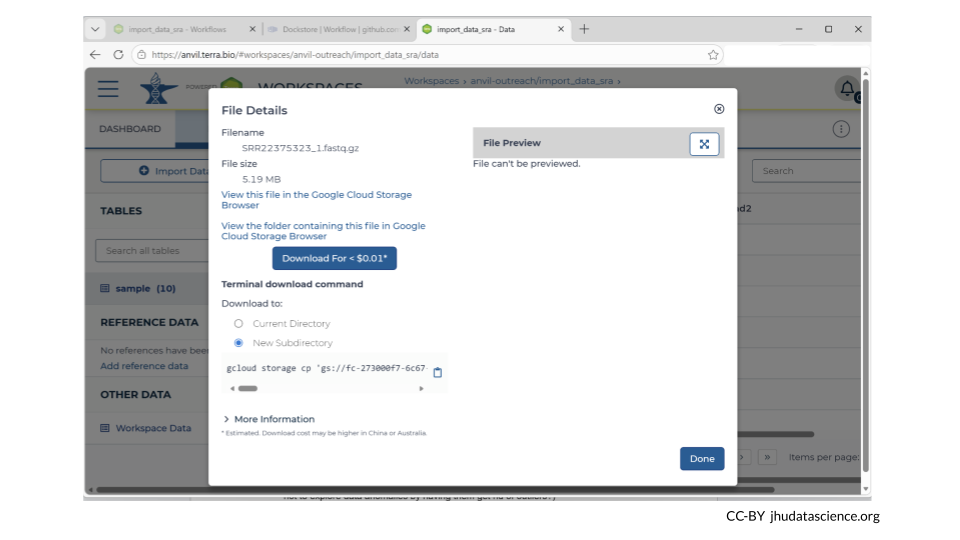

## Summary

- Create a workspace
- Import a WDL workflow from Dockstore
- Upload a TSV containing sample IDs
- Launch the WDL
- Check the workflow progress 
- Locate the transferred data files

## Additional Resources

- Sometimes you may want to import both a workflow and its parameter file into AnVIL. You can read about this option for Terra workspaces [here](https://support.terra.bio/hc/en-us/articles/360038137292-How-to-import-a-workflow-and-its-parameter-file-from-Dockstore-into-Terra).

- Sometimes a workflow is updated after you've imported it to your workspace. You can learn about updating your imported workflows to the newest version on AnVIL [here](https://support.terra.bio/hc/en-us/articles/360026443092-Updating-workflows-to-the-latest-version).

- You may want to add more columns to your metadata file. Learn about how the data tables are organized on AnVIL [here](https://support.terra.bio/hc/en-us/articles/360025758392-Managing-data-with-tables).

- If you have a lot of data, it's a good idea to estimate how much transfer time your need. Transfer a small file first and determine your transfer rate. Learn more about estimated transfer rates to Google Cloud via AnVIL [here](https://docs.cloud.google.com/architecture/migration-to-google-cloud-transferring-your-large-datasets#online_versus_offline_transfer).

- Learn more about moving data to and from Google buckets [here](https://support.terra.bio/hc/en-us/articles/4409101169051-How-to-move-data-to-from-a-Google-bucket).

