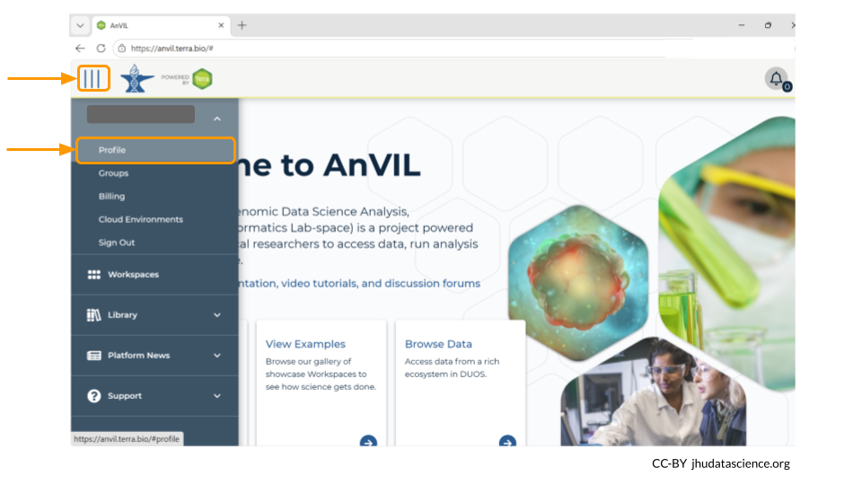
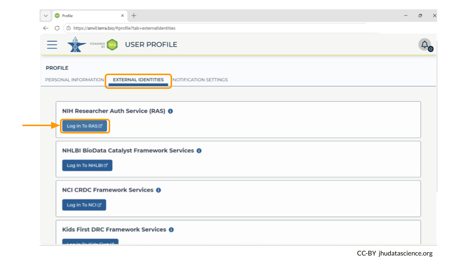
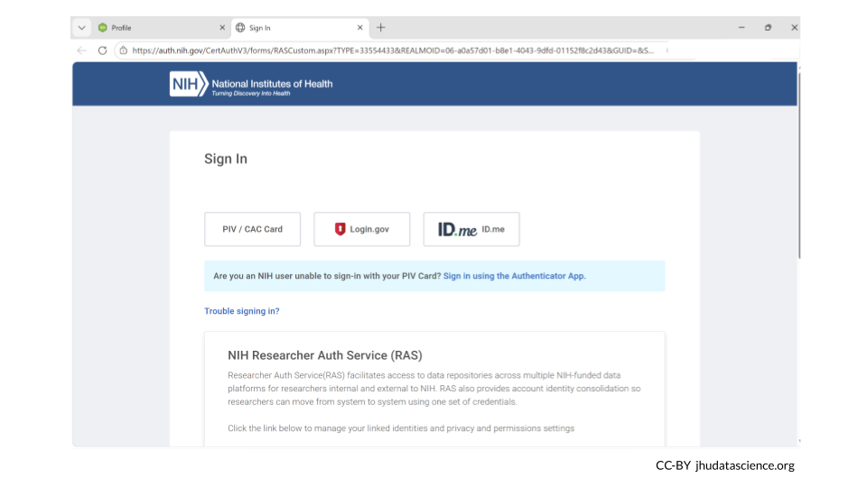

# Through dbGaP {#accessing-dbgap}

::: {.warning}
This vignette is currently under construction!
:::

There are two main steps for accessing controlled data through dbGaP:

1. Link your NIH account to your AnVIL (Terra) account. 

1. Bring data into your workspace.

::: {.notice}
_Genetics_

**Novice**: no genetics skills needed

_Programming skills_

**Beginner**: some comfort with workflows and WDLs may be needed
:::

::: {.notice}
**What will this cost?**
Linking your AnVIL ID to your NIH credentials does not cost anything. 

You may incur a cost if you use a WDL to bring data from dbGaP into your AnVIL workspace.

:::

## Link NIH Account to your AnVIL profile

When working with controlled-access data, it's very important that online platforms can verify your identity as a researcher.

We suggest using your institutional email to log in to AnVIL in most cases, **but it is required when working with controlled access data**.

> As part of new federal government security policies, Terra is required to integrate with the NIH Researcher Authentication Service (RAS) for identity proofing and enhanced security.  In order to link your NIH authorization to Terra, users of eRA Commons must transition to the use of Login.gov or ID.me credentials to access AnVIL controlled-access data in Terra. See [here](https://support.terra.bio/hc/en-us/articles/32634034451099-RAS-Integration-for-AnVIL-Data) for more details and instructions.

To link your NIH account to your AnVIL profile, go to [anvil.terra.bio/#profile](https://anvil.terra.bio/#profile). 

Next, look for the tab labeled "External Identities". Click "log in to RAS" under the NIH Researcher Auth Service (RAS) section.

This will take you to the NIH webpage in a new tab. Log in, and then navigate back to your AnVIL account. It may some time for your AnVIL credentials to be updated.

> Linking with RAS will allow Terra to automatically determine if you can access controlled datasets hosted in Terra based on your valid passport visas or your valid dbGaP applications via eRA Commons. Terra currently supports RAS authentication for AnVIL. 

::: {.notice}
You are required to renew the link between your RAS account and your AnVIL profile every 30 days to ensure continued access to controlled data.
:::

## Access data through an AnVIL workspace

You may need to use a workflow to bring the data into your AnVIL workspace. This can be done with dockstore.org.

## Additional Resources

Information on how to request access to dbGaP can be found [here](https://grants.nih.gov/policy-and-compliance/policy-topics/sharing-policies/accessing-data/dbgap).

You can follow this step-by-step tutorial by the National Library of Medicine on how to apply for access to controlled access data through dbGaP [here](https://www.youtube.com/watch?v=-3tUBeKbP5c).

The National Library of Medicine has created a video on how to [assign downloaders for dbGaP data](https://www.youtube.com/watch?v=Yem3OH26kX4). This is especially helpful if you have a student working with dbGaP data.

Read more about the NIH's Office of Data Science Strategy [Researcher Auth Service Initiative](https://datascience.nih.gov/researcher-auth-service-initiative). 
